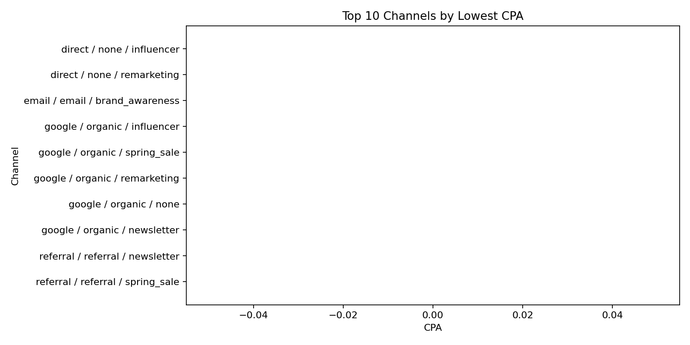

# Marketing Campaign Analysis (Entry-Level Portfolio)

Turn raw channel data into **actions** (budget shifts + funnel fixes) with Python in Colab.  
**Dataset:** synthetic, ~1,200 sessions over ~90 days.

## TL;DR (30-sec skim)
- **Best paid channel by CPA:** TikTok / paid_social / remarketing — **$3.27 CPA**, CR ≈ **10%**.  
- **Biggest funnel leak:** **Product → Cart ≈ 89.9%** drop.  
- **Impact estimate:** Reallocate **$100** from Instagram paid social (**$5.91 CPA**) to TikTok remarketing (**$3.27 CPA**) → **~13–14 extra conversions** (small-scale assumption).

   
  <em>Top 10 channels by lowest CPA</em>

## What’s inside
- `Project_1_Campaign_Analysis.ipynb` — full, runnable analysis notebook  
- `outputs/channel_summary.csv` — KPIs by source/medium/campaign  
- `outputs/funnel_summary.csv` — funnel counts by stage  
- `outputs/figures/cpa_by_channel.png`, `outputs/figures/conversion_rate_by_channel.png` — charts  
- **Brief (PDF):** [View / Download](./Campaign_Performance_Brief.pdf)

## Key findings
- **Paid efficiency:** TikTok remarketing leads (**$3.27 CPA; CR ~10%**). Google Brand Search (spring_sale) is close (**$3.80 CPA**).  
- **High-intent keyword:** Google CPC (newsletter) shows the **highest paid CR (~11.1%)** with solid CPA (**$4.88**).  
- **Funnel friction:** **Product → Cart** is the largest drop (~90%). Likely CTA placement / shipping clarity / social proof issues.  
- **2-week test plan:** shift a small % toward **TikTok remarketing + Google Brand/CPC**; monitor **incremental** lift & frequency.

## Run it (Colab)
1. Open the notebook via the badge above.  
2. **Runtime → Run all.**  
3. Results are written to `outputs/`.

## Data & definitions
- **Qualified session:** ≥2 pages or add-to-cart  
- **CPA:** total cost ÷ purchases  
- **Note:** synthetic data; this project demonstrates workflow + communication.

## Next steps
- A/B test product-page CTA + shipping/returns messaging to reduce Product→Cart drop.  
- Simplify checkout (wallets, fewer fields) to reduce Checkout→Purchase drop.  
- Add a simple weekly pipeline to refresh the KPIs + brief.

---

*Made in Python (pandas, matplotlib) on Google Colab.*
